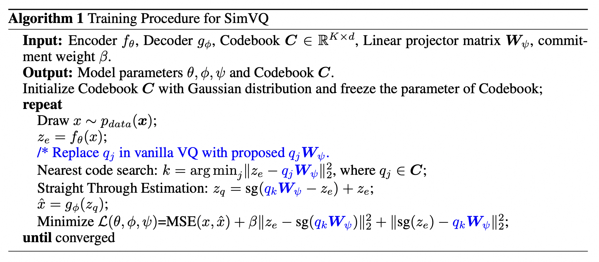
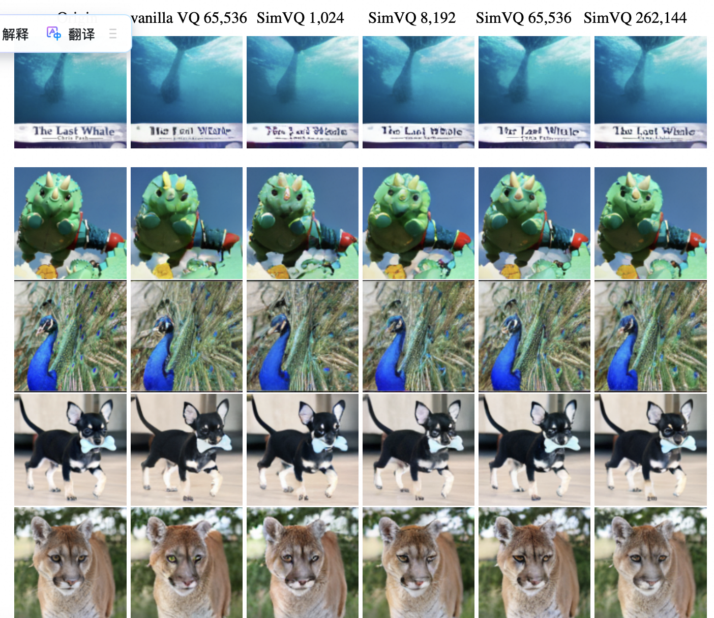
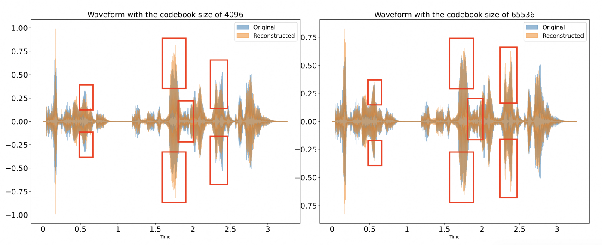

# SimVQ: Addressing Representation Collapse in Vector Quantized Models with One Linear Layer


<h5 align="center">

[](https://arxiv.org/abs/2411.02038)

</h5>

## News

* Checkpoints are released.

<details open><summary> Some other projects about Discrete Tokenizer based Multimodal GenAI from our team may interest you. </summary><p>
<!--  may -->

> [**[NeurIPS 2024] Stabilize the Latent Space for Image Autoregressive Modeling: A Unified Perspective**](https://github.com/DAMO-NLP-SG/DiGIT) <br>
> Yongxin Zhu, Bocheng Li, Hang Zhang, Xin Li, Linli Xu, Lidong Bing <br>
[](https://github.com/DAMO-NLP-SG/DiGIT)  [](https://github.com/DAMO-NLP-SG/DiGIT) [](https://arxiv.org/abs/2410.12490) <br>

> [**[ACL 2024] Generative Pre-Trained Speech Language Model with Efficient Hierarchical Transformer**](https://github.com/youngsheen/GPST) <br>
> Yongxin Zhu, Dan Su, Liqiang He, Linli Xu, Dong Yu <br>
[](https://github.com/youngsheen/GPST)  [](https://github.com/youngsheen/GPST) [](https://arxiv.org/abs/2406.00976) (Adopted by [Moshi](https://arxiv.org/abs/2410.00037))<br>

> [**[EMNLP 2023] DiffS2UT: A Semantic Preserving Diffusion Model for Textless Direct Speech-to-Speech Translation**](https://aclanthology.org/2023.emnlp-main.709) <br>
> Yongxin Zhu, Zhujin Gao, Xinyuan Zhou, Zhongyi Ye, Linli Xu <br>
[](https://arxiv.org/abs/2310.17570) <br>

</p></details>


**Algorithm for SimVQ** 

You can find the core code here https://github.com/youngsheen/SimVQ/blob/main/taming/modules/vqvae/quantize.py#L28-L33

<p align="center">

</p>


## Quantitative Comparison

**Table 1.** Reconstruction performance of different tokenizers on $128 \times 128$ ImageNet 50k validation set.
| Method | Codebook Size | Codebook Utilization | rFID | LPIPS | PSNR | SSIM | Checkpoint |
|:------:|:-------------:|:----:|:----:|:---------------------:|:----:|:----:|:----:|
|VQGAN | 65,536 |  1.4% | 3.74 |  0.17 | 22.20 | 70.6 | -|
|VQGAN | 65,536 |  4.5% | 3.23 |  0.15 | 22.89 | 72.3 | -|
|VQGAN-FC | 65,536 | 100.0% | 2.63 | 0.13 | 23.79 | 77.5 | - |
|FSQ | 64,000 | 100.0% | 2.80 | 0.13| 23.63 | 75.8 | - |
|LFQ | 65,536 | 100.0% | 2.88 | 0.13| 23.60 | 77.2 | - |
|VQGAN-LC | 65,536 | 100.0% | 2.40 | 0.13 | 23.98 | 77.3 | - |
|SimVQ (ours) | 1024 | 100.0% | 3.67 | 0.16 | 22.34 | 70.8 | [huggingface](https://huggingface.co/zyx123/SimVQ/tree/main/vq_log/simvq_1k) |
|SimVQ (ours) | 8192 | 100.0% | 2.98 | 0.14 | 23.23 | 74.7 | [huggingface](https://huggingface.co/zyx123/SimVQ/tree/main/vq_log/simvq_8k) |
|SimVQ (ours) | 65,536 | 100.0% | **2.24** | **0.12** | **24.15** | **78.4** | [huggingface](https://huggingface.co/zyx123/SimVQ/tree/main/vq_log/simvq_65k) |
|SimVQ (ours) | 262,144 | 100.0% | **1.99** | **0.11** | **24.68** | **80.3** | [huggingface](https://huggingface.co/zyx123/SimVQ/tree/main/vq_log/simvq_262k) |

   
**Table 2.** Reconstruction performance of different tokenizers on LibriTTS test clean/other set.

| Method | Bandwidth | Codebook Utilization | UTMOS | PESQ | STOI | V/UV F1 | Checkpoint |
|:------:|:-------------:|:----:|:----:|:---------------------:|:----:|:----:|:----:|
|Encodec | 3.0kbps | -/-% | 2.31/2.09 | 2.05/2.05 | 0.90/0.88 | 0.92/0.89 | - |
|Vocos | 3.0kbps | -/-% | 3.53/3.06 | 2.40/2.19 | 0.92/0.90 | 0.94/0.91 | - |
|SpeechTokenizer | 3.0kbps | -/-% | 3.56/3.02 | 1.93/1.74 | 0.88/0.84 | 0.93/0.89 | - |
|WavTokenizer | 0.9kbps | 100/100% | 3.74/3.43 | 2.01/2.26 | 0.89/0.89 | 0.92/0.92 | - |
|WavTokenizer | 1.05kbps | 27/-% | 4.00/- | 2.36/- | 0.81/- | 0.94/- | - |
|SimVQ (ours) | 0.9kbps | 100.0/100.0% | 4.00/3.51 | 2.33/2.08 | 0.91/0.88 | 0.94/0.91 | [huggingface](https://huggingface.co/zyx123/SimVQ/tree/main/vq_audio_log/simvq_4k) |
|SimVQ (ours) | 0.975kbps | 99.4/99.4% | 4.03/3.52 | 2.42/2.15 | 0.92/0.88 | 0.94/0.92 | [huggingface](https://huggingface.co/zyx123/SimVQ/tree/main/vq_audio_log/simvq_8k) |
|SimVQ (ours) | 1.2kbps | 99.4/99.0% | 4.03/3.52 | 2.54/2.26 | 0.93/0.90 | 0.94/0.92 | [huggingface](https://huggingface.co/zyx123/SimVQ/tree/main/vq_audio_log/simvq_65k) |
|SimVQ (ours) | 1.35kbps | 95.6/94.7% | 4.03/3.53 | 2.61/2.31 | 0.93/0.90 | 0.95/0.93 | [huggingface](https://huggingface.co/zyx123/SimVQ/tree/main/vq_audio_log/simvq_262k) |


## Implementations

### Installation

- **Dependencies**: `pip install -r requirements.txt`
- **Extra dependencies for audio evaluation**: `pip install -r requirements_audio.txt`
- **Datasets**
```
imagenet
└── train/
    ├── n01440764
        ├── n01440764_10026.JPEG
        ├── n01440764_10027.JPEG
        ├── ...
    ├── n01443537
    ├── ...
└── val/
    ├── ...
```

```
LibriTTS
└── train-clean-100/
    ├── 103/
        ├── 1241/
            ├── 103_1241_000000_000001.wav
            ├── ...
    ├── 1034
    ├── ...
└── train-clean-360/
    ├── ...
└── train-other-500/
    ├── ...
└── dev-other/
    ├── ...
└── dev-clean/
    ├── ...
└── test-other/
    ├── ...
└── test-clean/
    ├── ...
```

### Training Scripts
* Image Tokenizer Training
```
XDG_CACHE_HOME="dataset/ILSVRC2012" python main.py fit --config configs/imagenet_simvq_128_B.yaml
```

* Audio Tokenizer Training

You can get manifest .txt with generate_manifest.py

```
DATA_ROOT="dataset/libritts" python main.py fit --config configs/libritts_24khz.yaml
```

### Evaluation Scripts
* Image Tokenizer Evaluation
```
XDG_CACHE_HOME="dataset/ILSVRC2012" python evaluation.py --config_file vq_log/simvq_262k/size128/config.yaml --ckpt_path vq_log/simvq_262k/epoch=49-step=250250.ckpt
```

* Audio Tokenizer Evaluation
```
DATA_ROOT="dataset/libritts" python evaluation_speech.py --config_file vq_audio_log/simvq_262k/1second/config.yaml --ckpt_path vq_audio_log/simvq_262k/epoch=49-step=138600.ckpt
```


## Reconstruction Visualization

**Figure 2.** Visualization of the Open-MAGVIT2 tokenizer trained at $128 \times 128$ resolution (`imagenet_simvq_128_Base` version). (a) indicates the original images while (b) specifies the reconstruction images.
<p align="center">
    
</p>

**Figure 3.** Visualization of the Open-MAGVIT2 tokenizer trained at LibriTTS (`libritts_24khz` version). (a) indicates the original images while (b) specifies the reconstruction images.
<p align="center">
    
</p>


## Acknowledgement
The codebase of SimVQ is adapted from [Open-MAGVIT2](https://github.com/TencentARC/Open-MAGVIT2) and [WavTokenizer](https://github.com/jishengpeng/WavTokenizer). Thanks for their wonderful work.